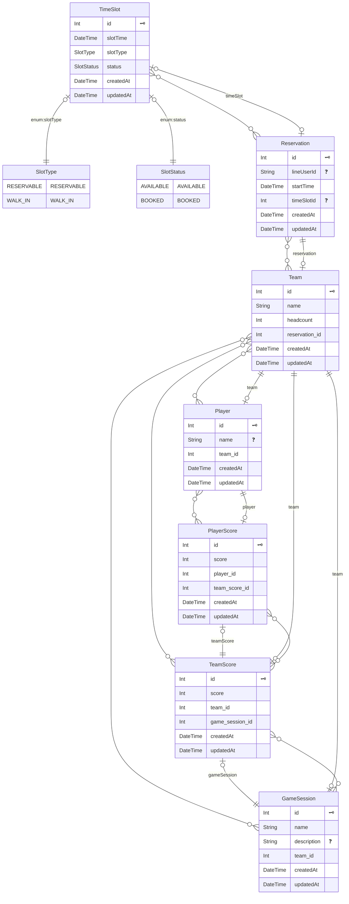

```mermaid
erDiagram

        SlotType {
            RESERVABLE RESERVABLE
WALK_IN WALK_IN
        }
    


        SlotStatus {
            AVAILABLE AVAILABLE
BOOKED BOOKED
        }
    
  "TimeSlot" {
    Int id "🗝️"
    DateTime slotTime 
    SlotType slotType 
    SlotStatus status 
    DateTime createdAt 
    DateTime updatedAt 
    }
  

  "Reservation" {
    Int id "🗝️"
    String lineUserId "❓"
    DateTime startTime 
    Int timeSlotId "❓"
    DateTime createdAt 
    DateTime updatedAt 
    }
  

  "Team" {
    Int id "🗝️"
    String name 
    Int headcount 
    Int reservation_id 
    DateTime createdAt 
    DateTime updatedAt 
    }
  

  "Player" {
    Int id "🗝️"
    String name "❓"
    Int team_id 
    DateTime createdAt 
    DateTime updatedAt 
    }
  

  "GameSession" {
    Int id "🗝️"
    String name 
    String description "❓"
    Int team_id 
    DateTime createdAt 
    DateTime updatedAt 
    }
  

  "TeamScore" {
    Int id "🗝️"
    Int score 
    Int team_id 
    Int game_session_id 
    DateTime createdAt 
    DateTime updatedAt 
    }
  

  "PlayerScore" {
    Int id "🗝️"
    Int score 
    Int player_id 
    Int team_score_id 
    DateTime createdAt 
    DateTime updatedAt 
    }
  
    "TimeSlot" o|--|| "SlotType" : "enum:slotType"
    "TimeSlot" o|--|| "SlotStatus" : "enum:status"
    "TimeSlot" o{--}o "Reservation" : ""
    "Reservation" o|--|o "TimeSlot" : "timeSlot"
    "Reservation" o{--}o "Team" : ""
    "Team" o|--|| "Reservation" : "reservation"
    "Team" o{--}o "Player" : ""
    "Team" o{--}o "GameSession" : ""
    "Team" o{--}o "TeamScore" : ""
    "Player" o|--|| "Team" : "team"
    "Player" o{--}o "PlayerScore" : ""
    "GameSession" o|--|| "Team" : "team"
    "GameSession" o{--}o "TeamScore" : ""
    "TeamScore" o|--|| "Team" : "team"
    "TeamScore" o|--|| "GameSession" : "gameSession"
    "TeamScore" o{--}o "PlayerScore" : ""
    "PlayerScore" o|--|| "Player" : "player"
    "PlayerScore" o|--|| "TeamScore" : "teamScore"
```
